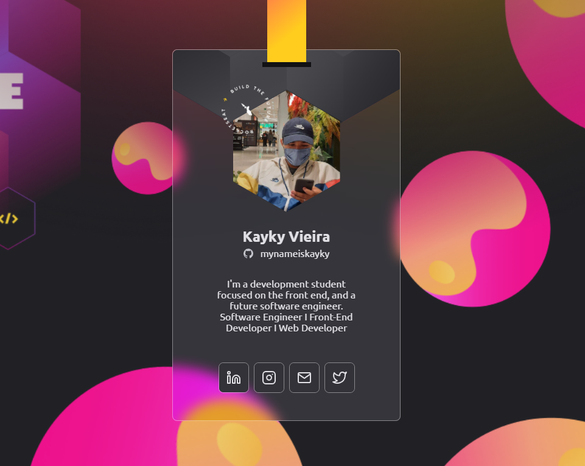

# Crachá DoWhile 2021

  <a href="#tecnologias">Tecnologias</a> ・
   
  <a href="#projeto">Projeto</a> ・
  <a href="#adicionais">adicionais</a>

  

## Tecnologias

Esse projeto foi desenvolvido com as seguintes tecnologias:

- HTML
- CSS
- JavaScript

### Bibliotecas

- [Google Fonts](https://www.fonts.google.com/)
- [Tilt.js](https://github.com/gijsroge/tilt.js)
- [ScrollReveal](https://github.com/jlmakes/scrollreveal)
- [GitHub API](https://docs.github.com/pt/github/extending-github/getting-started-with-the-api)

 

## Projeto

Projeto proposto da @rocketseat em um evento online com 5 aulas de grandes aprendizados para mim, pude concluir este projeto com muita dedição, ele basicamente consiste em ser um crachá digital com ultilidade para o futuro no evento do DoWhile 2021

Veja este projeto <a href="https://mynameiskayky.github.io/Badge-Do-While2021/" target="_blank">aqui</a>

 

## adicionais

Incremetei o projeto com mais elementos, um deles foi as animações com as <a href="#bibliotecas">bibliotecas acima</a>, também usei o efeito Glassmorphism no card (Crachá)

---

Feito com 💙 por <a href="https://www.linkedin.com/in/kaykyvieraa/">Kayky Vieira</a>

